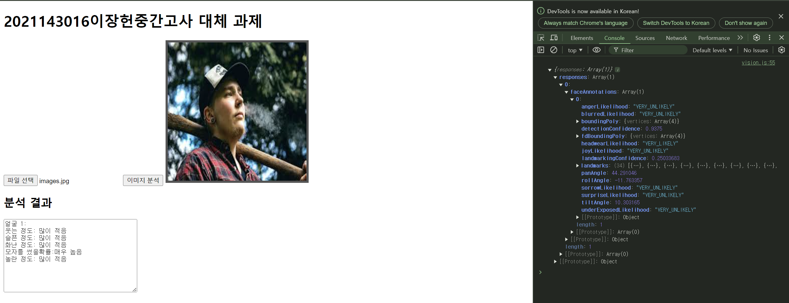
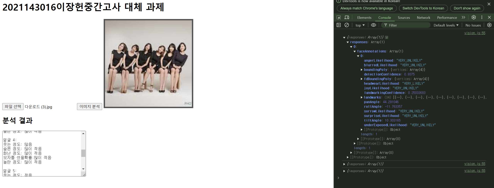

# project1-2024
2024-2학기 켑스톤프로젝트 수업
openAPI를 사용한 인공지능 시스템 실습


# openweathermap

지정된 장소의 현재 날씨를 표시
https://api.openweathermap.org/data/2.5/weather?q=Seoul&units=metric&appid=7d96bc5108f52b80e2d9075a369b9f35
- [실습해보기](https://api.openweathermap.org/data/2.5/weather?q=Seoul&units=metric&appid=7d96bc5108f52b80e2d9075a369b9f35)

```javascript
		$.ajax({
			type: "GET",
			url: 'https://api.openweathermap.org/data/2.5/weather?q=Seoul&units=metric&appid=7d96bc5108f52b80e2d9075a369b9f35',
		}).done(function(response) {
			
			console.log(response)
			
		}).fail(function(error) {
			alert("!/js/user.js에서 에러발생: " + error.statusText);
		});
```
# openAI 
 
# google cloud vision



midtest파일 프로그램 설명 <br>
사진을 넣으면 얼굴을 감지해 감지한 얼굴수와 표정을 읽어들여 출력하는 프로그램 
1. 파일 업로드에 사진을 넣는다.
2. 이미지 분석을 클릭한다.
3. 분석 결과를 감상한다.


개발순서
1. 소스수정
2. 소스 저장
3. 스테이지
4. 커밋에 푸쉬
5. 커밋메세지


git 설정 

2024-9-19 깃허브연동실습
로컬에서 편집함

